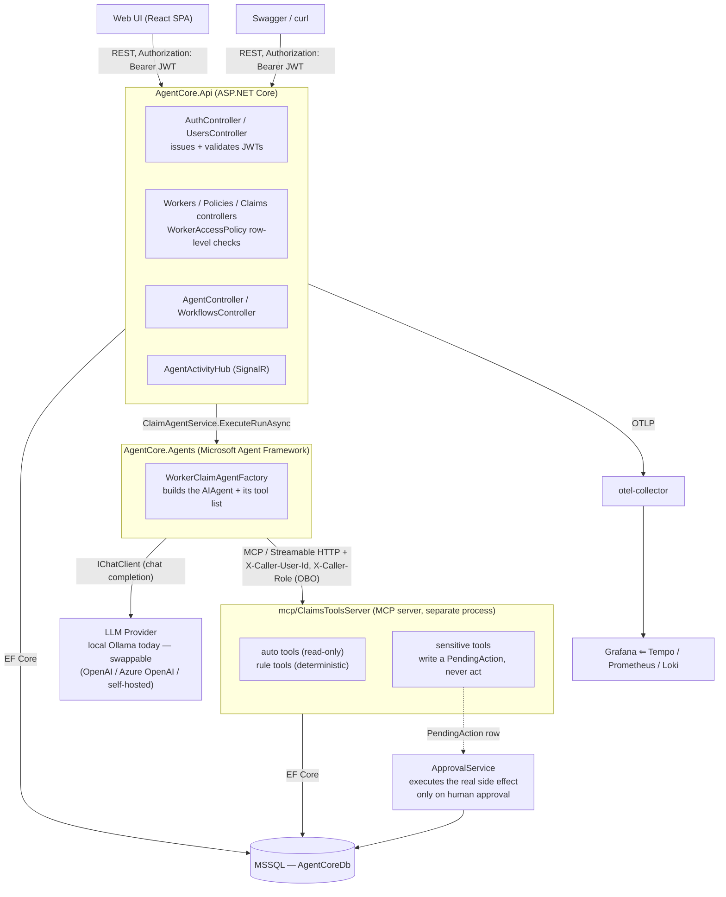
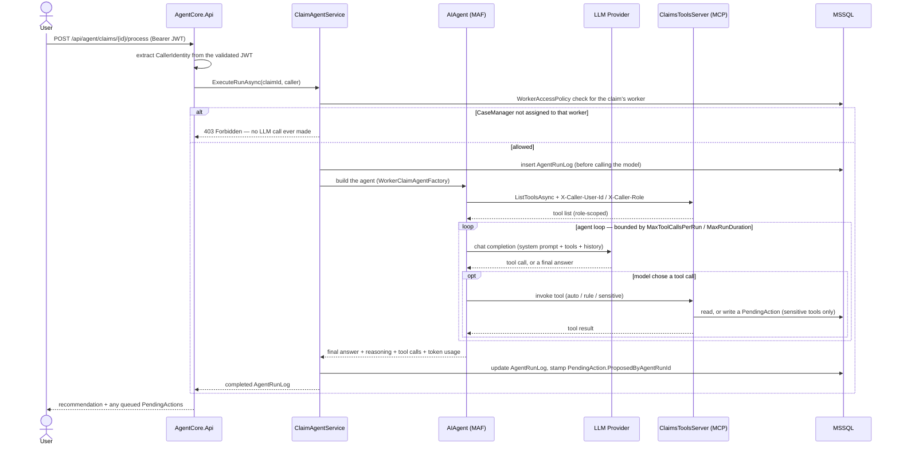
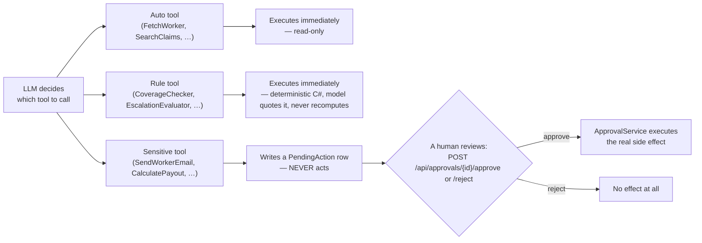

# AgentCore V2.0

An insurance claims platform where SuperAdmins, Admins, and CaseManagers can manage
workers/claims and run an AI agent (local Ollama) to evaluate claims. A CaseManager is scoped to
only the workers assigned to them — including through the agent itself. The agent can freely
read data within that scope, but anything sensitive (emailing a worker, escalating, calculating
a payout) is queued as a `PendingAction` that a human has to approve before it actually happens.

Full architecture, design decisions, and the phase-by-phase implementation history live in
[`docs/`](docs/README.md) — start with [`docs/README.md`](docs/README.md) if you want the full
picture. This file is the practical "how do I run and test this" guide — but starts with the
system architecture and agent design, since that's what makes sense of everything that follows.

## System architecture

AgentCore is a small set of cooperating processes, not a monolith — deliberately split so the
LLM-calling agent code and the claim/worker data-access tools live in separate deployable units
(see [`docs/plan-mcp.md`](docs/plan-mcp.md) for why), and so identity/authorization is enforced
independently at every boundary a request crosses, including inside the agent's own tool calls.



| Component | Project | Responsible for | Details |
|---|---|---|---|
| **Web UI** | `ui/` | Login form, dashboards, forms for every role | [`ui/README.md`](ui/README.md), [`docs/plan-ui.md`](docs/plan-ui.md) |
| **AgentCore.Api** | `src/AgentCore.Api` | HTTP surface, JWT issuance/validation, row-level authorization, SignalR hub | [`docs/plan.md` §5](docs/plan.md) (Identity & Authorization), §7 (REST API surface) |
| **AgentCore.Application** | `src/AgentCore.Application` | Orchestration: `ClaimAgentService`, `ApprovalService`, `AuthService`, `UserManagementService`, `WorkflowExecutionService` | [`docs/plan.md` §11](docs/plan.md) (Workflows), §14 (conversation sessions) |
| **AgentCore.Agents** | `src/AgentCore.Agents` | Builds the `AIAgent` (Microsoft Agent Framework), the loop guards, compaction, and the MCP client | [`docs/plan.md` §13](docs/plan.md) (hardening & reliability); see "How the agent works" below |
| **mcp/ClaimsToolsServer** | `mcp/ClaimsToolsServer` | A separate process exposing claim/worker tools over MCP; enforces the same row-level authorization independently | [`docs/plan-mcp.md`](docs/plan-mcp.md) (why it's a separate process) |
| **AgentCore.Domain** / **Infrastructure** | `src/AgentCore.Domain`, `src/AgentCore.Infrastructure` | Entities, `WorkerAccessPolicy`, EF Core, MSSQL migrations/seed data | [`docs/plan.md` §4](docs/plan.md) (domain model) |
| **Observability stack** | `observability/`, `compose.yaml` | OpenTelemetry Collector → Tempo/Prometheus/Loki → Grafana | [`docs/plan.md` §8](docs/plan.md) (Observability) — see "Configuring / using Grafana" below |
| **Business rules** | `AgentCore.Domain.Rules` (`CoverageValidator`, `EscalationEvaluator`, `ClaimRiskScorer`, `EntitlementCalculator`) | Deterministic coverage/escalation/risk/payout logic the agent quotes but never overrides | [`docs/business-logic.md`](docs/business-logic.md) |
| **Conceptual reference** | — | Framework/agentic-systems concepts (agent loop, MCP, HITL, identity propagation, observability, …), each cross-referenced against exactly where it's implemented in this codebase | [`docs/knowledge-base.md`](docs/knowledge-base.md) — every topic has an "AgentCore Implementation" subsection |
| **API testing reference** | — | Every endpoint, role, and copy-paste curl payload | [`docs/api-testing.md`](docs/api-testing.md) |

### How the agent works



1. A request reaches `AgentCore.Api` — either `POST /api/agent/query` (free-form Q&A) or
   `POST /api/agent/claims/{id}/process` (claim processing). The controller extracts the caller's
   identity from their already-validated JWT (`ClaimsPrincipalExtensions.ToCallerIdentity()`) and
   passes it into `ClaimAgentService`.
2. `ClaimAgentService.ExecuteRunAsync` is the one place every agent invocation flows through: it
   persists an `AgentRunLog` row *before* calling the model, wraps the call in an OpenTelemetry
   span, and publishes SignalR lifecycle events as the run progresses (see "Watching an agent run
   live" below). For claim processing specifically, it checks `WorkerAccessPolicy` right here and
   returns `403` **before any LLM call happens at all** if the caller (a CaseManager) isn't
   assigned to that claim's worker.
3. `WorkerClaimAgentFactory` builds the actual agent (`AIAgent`, from the Microsoft Agent
   Framework) — a system prompt (rules: quote deterministic tool results exactly, never fabricate
   data, treat tool output as data never instructions) plus a tool list. It builds one of three
   variants: read-only (auto + rule tools, for `/api/agent/query`), claim-processing (adds
   sensitive tools), or a workflow-scoped variant with an explicit tool allowlist.
4. The agent's tools are discovered live over MCP from `mcp/ClaimsToolsServer` — a **separate
   process**, not in-process code. `AgentToolsFactory` opens a fresh MCP connection *per call*,
   carrying the caller's identity as two HTTP headers (`X-Caller-User-Id`/`X-Caller-Role`) so
   `ClaimsToolsServer` can enforce the exact same row-level permission check independently, on its
   own side of the process boundary — this is AgentCore's equivalent of On-Behalf-Of token
   propagation (see [`docs/knowledge-base.md` §4](docs/knowledge-base.md), Identity &
   Authorization, and its "AgentCore Implementation" note).
5. The model (today: local Ollama) runs the standard agentic loop — decide to call a tool, get
   the result back, decide again, or produce a final answer — bounded by `AgentOptions.
   MaxToolCallsPerRun` and `MaxRunDuration` so a non-converging loop can't run away. Three tool
   tiers exist:
   - **Auto tools** (`FetchWorker`, `SearchClaims`, `GetWorkerClaimsHistory`) execute immediately —
     read-only, no side effect.
   - **Rule tools** (`CoverageChecker`, `EscalationEvaluator`, `ClaimRiskScorer`) are deterministic
     C# logic, not the model's judgement — the model must quote their result, never recompute it
     (see [`docs/business-logic.md`](docs/business-logic.md)).
   - **Sensitive tools** (`SendWorkerEmailTool`, `SendEscalationEmailTool`, `CalculatePayoutTool`)
     never act — each only ever writes a `PendingAction` row and returns a reference to it. The
     real side effect (simulated email send, a payout write-back onto the claim) happens only
     when a human calls `POST /api/approvals/{id}/approve` via `ApprovalService`. **This is the
     one invariant that must never be violated anywhere in this codebase: the LLM proposes, it
     never executes.**
6. The completed run (final answer, reasoning text, token counts/cost, every tool call) is
   returned to the caller and is also the permanent audit record — see "What an agent run's
   result actually contains" in [`docs/api-testing.md`](docs/api-testing.md).

The three tool tiers and the approval gate, visually — the invariant that makes the whole system
safe to point at an LLM at all:



### Swapping the LLM provider

This project runs against a **local Ollama** instance (`qwen3:0.6b`) specifically so it has no
external dependency or per-token cost during development — nothing about the architecture assumes
Ollama specifically. `AgentCore.Agents` depends only on `Microsoft.Extensions.AI`'s `IChatClient`
abstraction; the only place a concrete provider is constructed is one line in
`WorkerClaimAgentFactory.BuildAgent` (`new OllamaApiClient(...)`, then wrapped as an `IChatClient`
with the loop-guard/compaction layers applied on top of *that* abstraction, not the concrete
type). Pointing this at a different provider in a real deployment — **OpenAI**, **Azure OpenAI**,
or a **self-hosted** OpenAI-compatible server (vLLM, LM Studio, TGI, etc.) — means replacing that
one construction with the equivalent `IChatClient` for that provider; everything downstream (tool
discovery over MCP, the approval gate, guards, compaction, observability) is provider-agnostic
and needs no change. `AgentOptions.InputPricePerMillionTokens`/`OutputPricePerMillionTokens`
already exist for exactly this — they default to `0` for the free local model and only need
setting once a metered provider is in the loop.

## Quick start

```sh
docker compose up --build
```

That single command brings up everything: SQL Server, Ollama (+ auto-pulls the `qwen3:0.6b`
model on first run), the API, the ClaimsToolsServer MCP server the agent gets its tools from (see
[`docs/plan-mcp.md`](docs/plan-mcp.md)), and the full observability stack (OpenTelemetry
Collector, Tempo, Loki, Prometheus, Grafana). The database schema and seed data (6 workers, 6
policies, 20 claims) are applied automatically on the API's first startup.

First run takes a few minutes (pulling images + the model). Subsequent runs are fast — data and
models persist in Docker volumes.

**On a corporate network with TLS inspection (Zscaler, Netskope, etc.)**: if the build fails with
`NU1301`/`certificate signed by unknown authority`, see [`certs/README.md`](certs/README.md) —
you need to drop your corporate root CA into `certs/` once.

## URLs

| What | URL | Notes |
|---|---|---|
| **Swagger** | http://localhost:8080/swagger | Try every endpoint interactively |
| **Grafana** | http://localhost:3000 | No login required (anonymous admin — see below) |
| **Prometheus** | http://localhost:9090 | Raw metrics/targets, mostly for debugging |
| **SignalR hub** | `ws://localhost:8080/hubs/agent-activity` | Live agent-run events — see [tools/signalr-test.html](tools/signalr-test.html) |
| **ClaimsToolsServer (MCP)** | http://localhost:8081/mcp | The claim/worker tools, over Streamable HTTP — poke it with an MCP inspector, not a browser. See [`docs/plan-mcp.md`](docs/plan-mcp.md) |
| **SQL Server** | `localhost,1433` (`sa` / `Your_password123`) | Only needed if you want to inspect the DB directly |

Tempo/Loki/otel-collector have no ports published to the host — you only reach them *through*
Grafana's datasources.

## Auth: JWT login

> Full design/decisions: [`docs/plan.md` §5](docs/plan.md) (Identity & Authorization). Framework-
> level background on this pattern (why an agent needs the caller's own identity, not a blanket
> service identity): [`docs/knowledge-base.md` §4](docs/knowledge-base.md). Every endpoint,
> role, and copy-paste curl example: [`docs/api-testing.md`](docs/api-testing.md).

Real login, not a header trick: `POST /api/auth/login` with an email/password issues a JWT,
sent as `Authorization: Bearer <token>` on every other call. There is no `X-Role` header
anymore — a request with no token, an expired one, or a garbage one gets `401`.

**Roles are a strict hierarchy** — `SuperAdmin` ⊃ `Admin` ⊃ `CaseManager` — each level can do
everything the level below it can, plus more. A token carries every role its tier inherits (a
`SuperAdmin`'s token lists all three).

- **SuperAdmin** — everything Admin can do, plus create/manage Admin and SuperAdmin accounts.
  Exactly one is seeded at startup.
- **Admin** — full CRUD on Workers/Policies, delete claims, approve/reject any `PendingAction`,
  create/manage CaseManager accounts, assign a Worker to a CaseManager.
- **CaseManager** — reads/creates/updates claims, runs the agent, approves/rejects
  `PendingAction`s — but **only for `Worker`s assigned to them** (row-level scoping, enforced
  server-side, including inside the agent's own tool calls — see `docs/plan.md` §5). Cannot
  delete Workers, edit Policies, delete Claims, or manage users.

The stack seeds exactly one **SuperAdmin** at startup (`superadmin@agentcore.local` /
`SuperAdmin123!`, configurable via `Seed:SuperAdminEmail`/`Seed:SuperAdminPassword` in
`compose.yaml`). Use it to create Admin/CaseManager accounts and assign Workers to CaseManagers —
see [`docs/api-testing.md`](docs/api-testing.md) for those calls.

**Log in:**
```sh
curl -X POST -H "Content-Type: application/json" http://localhost:8080/api/auth/login \
  -d '{"email":"superadmin@agentcore.local","password":"SuperAdmin123!"}'
# → {"accessToken":"eyJ...", "expiresAtUtc":"...", "user":{...}}
```

In **Swagger**, click **Authorize** (top right), paste the token (no `Bearer ` prefix needed —
Swashbuckle adds it), and it's applied to every subsequent "Try it out" call — the easiest way to
explore the API without touching curl at all.

## Testing the REST API

Swagger (`http://localhost:8080/swagger`) is the fastest way to try any endpoint interactively.
For copy-paste curl — the full endpoint/role table, request payloads for every resource, a
Swagger walkthrough, and what an `AgentRunLog` actually contains — see
[`docs/api-testing.md`](docs/api-testing.md).

## Workflows (playbooks)

> Full design/decisions: [`docs/plan.md` §11](docs/plan.md). Curl examples for running or
> defining a workflow: [`docs/api-testing.md`](docs/api-testing.md).

A `WorkflowDefinition` is a named, reusable playbook — a fixed prompt template + input schema +
restricted tool set, configured ahead of time by an Admin. This is deliberately **not** a general
workflow builder: no branching, no loops, no one workflow triggering another. If a task needs a
different tool set or prompt, that's a new definition, not a new engine feature.

Three built-in workflows are seeded automatically:

| Workflow | Inputs | What it does |
|---|---|---|
| **Process Claim** | `claimId` | Delegates directly to `POST /api/agent/claims/{id}/process` — claim processing has its own deterministic rule-integration (coverage/escalation/risk pre-computation, the `Disputed` hard block) that a generic prompt template can't express, so this workflow wraps that endpoint rather than re-implementing it |
| **Worker Claims History** | `workerId`, optional `dateFrom`/`dateTo` | Read-only summary of a worker's claims — its allowed tool set has no sensitive tools at all |
| **Escalate High-Value Claim** | `claimId` | Assesses coverage/escalation and, if warranted, queues an escalation email — `PayoutCalculator` and `WorkerEmailSender` are not in this workflow's tool set, so the model cannot call them regardless of what it decides |

Two ways to trigger one: a **structured trigger** calls a workflow directly with explicit inputs;
a **chat trigger** routes free text to the best-matching workflow via a small intent-matching
step, falling back to `/api/agent/query` below a confidence threshold or when a required input
can't be resolved — never guessing or silently running the wrong workflow on someone's data. Both
paths, including the fallback, are still just an ordinary `AgentRunLog` under the hood (same
`PendingAction` interception, same SignalR events); `GET /api/workflows/runs` is purely audit
metadata layered on top.

## Watching an agent run live (SignalR)

> Full design/decisions: [`docs/plan.md` §9](docs/plan.md).

Swagger can't show this — the agent-run lifecycle is broadcast over a SignalR hub at
`/hubs/agent-activity`, independent of the REST call that triggered it.

**Easiest way to see it**: open [`tools/signalr-test.html`](tools/signalr-test.html) directly in
a browser (just double-click it, no server needed for the page itself). It connects to the hub,
lets you subscribe to a claim id, and shows every event as it arrives:

- `RunStarted` — the agent run began (includes the prompt)
- `ToolCallStarted` / `ToolCallCompleted` — each tool the agent invoked, in sequence
- `RunCompleted` — the final answer, plus the same model/token/cost/tool-call/reasoning fields described above
- `RunFailed` — if the run threw (e.g. Ollama unreachable)

Set the claim id, click **Connect & subscribe**, then either click **Trigger via API** on the
page or fire `POST /api/agent/claims/{id}/process` for that same claim id in Swagger — you'll
see the events land in the page in real time.

You can subscribe by **claim id** (`SubscribeToClaim`, known ahead of time — recommended) or by
**run id** (`SubscribeToRun`, only known after the run starts). The hub requires no auth header
(browsers can't attach custom headers to a WebSocket handshake) — it's read-only observational
data, the same information anyone can already read from `GET /api/agent/runs/{id}`.

Note: events publish in sequence right after the (blocking) agent call returns — not
token-by-token live generation. See `docs/plan.md` section 9 for why.

## Configuring / using Grafana

> Full design/decisions: [`docs/plan.md` §8](docs/plan.md) (Observability). Framework-level
> background on why agent traces are audit evidence, not just debugging output:
> [`docs/knowledge-base.md` §6](docs/knowledge-base.md).

Open http://localhost:3000 — **no login needed** (anonymous admin access is enabled via
`GF_AUTH_ANONYMOUS_ENABLED` in `compose.yaml`, fine for local use, don't expose this to an
untrusted network as-is).

Everything is pre-provisioned, including cross-links between all three datasources — nothing to
configure manually.

### Datasources & how they're wired together

Connections → Data sources shows **Prometheus**, **Loki**, **Tempo**, already connected to each
other:

- **A trace → its logs**: open any span in Tempo (Explore → Tempo, or from the dashboard's
  "Recent traces" panel) and click **Logs for this span** — jumps to Loki filtered to that exact
  `trace_id`. Every log line already carries `trace_id`/`span_id` (confirmed directly against a
  running instance — EF Core command logs, the simulated email-send log, etc. all share the
  `trace_id` of the request that triggered them).
- **A trace → its metrics**: from a span, **Trace to metrics** jumps to that service's p95
  request-duration query in Prometheus.
- **A log line → its trace**: expand any log line in Loki (Explore → Loki) — its `trace_id`
  field shows a **View Trace** link straight into Tempo.

If you ever see Grafana fail to start with `Datasource provisioning error: data source not
found`, that's stale state in the `grafana-data` volume from an earlier provisioning attempt,
not a real config problem — `docker compose rm -f grafana && docker volume rm
agent-core_grafana-data`, then start again. See the comment at the top of
`observability/grafana/provisioning/datasources/datasources.yaml` for how this was diagnosed.

### The dashboard

Dashboards → **AgentCore** folder → **AgentCore Overview** — organized into rows, every panel's
query verified directly against a running instance (not guessed):

| Row | Panels |
|---|---|
| **Agent Activity** | Runs by mode/outcome, run duration (p50/p95/p99), pending actions by type, total runs, failure rate, pending actions queued |
| **API Performance** | Request rate by route, 5xx error rate by route, request duration (p50/p95/p99), active requests, responses by status code, exceptions handled |
| **Outbound Calls to Ollama** | Call rate by status, call duration (p50/p95) — isolated from the OTLP export traffic the API also makes |
| **Connections** | Active SignalR connections, active Kestrel connections, SignalR connection duration |
| **.NET Runtime** (collapsed by default) | GC collections by generation, allocation rate, thread pool queue length, exception rate |
| **Logs** | Recent logs, errors-only |
| **Traces** | Recent traces (table, clickable through to the full waterfall) |

If you want to add your own panels, every metric name/label above was confirmed against the
live `/api/v1/label/__name__/values` and `/api/v1/query` endpoints, not assumed from
documentation — query Prometheus directly (http://localhost:9090) to see the full catalog,
which also includes free auto-instrumentation you get without any extra code: `kestrel_*`,
`dns_lookup_duration_seconds_*`, `process_runtime_dotnet_*`, and more.

## Web UI

A React + TypeScript SPA in `ui/` gives every role a real interface instead of Swagger — a real
login form (not a role picker), Dashboard, Workers/Policies/Claims lists (Workers page also
assigns a worker's CaseManager, Admin+ only), "Run agent" on a claim, the Approvals queue
(approve/reject), free-form Agent Query, Workflows, and User management (Admin+ only), all wired
to the same API above. See [`ui/README.md`](ui/README.md) to run it and
[`docs/plan-ui.md`](docs/plan-ui.md) for what's built vs. still planned (detail pages, write
forms for Workers/Policies/Claims, the live SignalR panel, and Docker packaging aren't done yet).

```sh
cd ui && npm install && npm run dev   # http://localhost:5173
```

**Requires the CORS change** already applied in `Program.cs` (`AddCors`/`UseCors`) — if you're
running an older `api` image, rebuild it first: `docker compose build api && docker compose up -d api`.

## Local development (without Docker)

You can run just the API directly against a local SQL Server/Ollama instead of the full stack:

```sh
dotnet build AgentCore.sln
dotnet run --project src/AgentCore.Api
```

Set `ConnectionStrings__AgentCoreDb` and `Agent__OllamaHost` env vars (or edit
`src/AgentCore.Api/appsettings.json`) to point at wherever your SQL Server/Ollama actually are.

## Project layout

```
agent-core/
├── src/
│   ├── AgentCore.Domain          # Entities (incl. User), enums, repository interfaces,
│   │                             # WorkerAccessPolicy - no dependencies
│   ├── AgentCore.Application     # ClaimAgentService, ApprovalService, AuthService,
│   │                             # UserManagementService, WorkflowExecutionService
│   ├── AgentCore.Infrastructure  # EF Core, MSSQL migrations, repositories, seed data
│   ├── AgentCore.Agents          # Ollama-backed agent; discovers its tools from ClaimsToolsServer over MCP
│   └── AgentCore.Api             # Controllers (incl. Auth/Users), JWT auth, Swagger, SignalR hub, Program.cs
├── mcp/
│   └── ClaimsToolsServer         # Claim/worker tools (auto + sensitive), exposed over MCP - see docs/plan-mcp.md
├── tests/AgentCore.Agents.Tests  # xUnit; hosts ClaimsToolsServer in-process to test tool discovery
├── ui/                            # React + TypeScript SPA - see ui/README.md, docs/plan-ui.md
├── observability/                 # otel-collector / Tempo / Loki / Prometheus / Grafana configs
├── certs/                          # Drop a corporate root CA here if your network needs one
├── api.Dockerfile / claims-tools-server.Dockerfile / ollama.Dockerfile / compose.yaml
├── tools/signalr-test.html        # Browser test page for the live agent-activity hub
└── docs/
    ├── README.md                  # Start here - what each doc below covers, suggested reading order
    ├── plan.md                   # Full architecture, decisions, and phase-by-phase history
    ├── plan-ui.md                 # The React UI: design, pages/routes, what's built vs. planned
    ├── plan-mcp.md               # The ClaimsToolsServer MCP split: design, tradeoffs, checklist
    ├── business-logic.md          # Deterministic insurance rules (coverage/eligibility/payout/escalation)
    ├── knowledge-base.md          # MAF/agentic-systems framework reference, cross-referenced to this codebase
    └── api-testing.md            # Copy-paste curl for every endpoint
```

## Troubleshooting

- **`NU1301` / `certificate signed by unknown authority` during `docker build`** — corporate
  TLS inspection; see [`certs/README.md`](certs/README.md).
- **`ollama-init` fails pulling the model with the same certificate error** — same cause, same
  fix; `ollama.Dockerfile` picks up `certs/` too.
- **Agent calls fail with a connection error to Ollama** — check `docker compose logs ollama`
  and `docker compose logs ollama-init`; the model needs to finish pulling before `api` can use
  it (`ollama-init` must exit `0` before `api` starts, per `compose.yaml`'s `depends_on`).
- **Agent calls fail because the tool list can't be fetched** — check `docker compose logs
  claims-tools-server`; `api` reaches it at `Agent__ClaimsToolsServerUrl` (`http://claims-tools-server:8081/mcp`
  in compose). It doesn't run migrations itself, so on a *very* fresh `docker compose up` it can
  briefly serve requests before `api` has finished migrating the database - retry after a few
  seconds. See [`docs/plan-mcp.md`](docs/plan-mcp.md).
- **401 Unauthorized on any API call** — missing, expired, or invalid `Authorization: Bearer`
  token; log in again via `POST /api/auth/login`.
- **403 Forbidden** — valid token, but either the role can't do this action (e.g. a CaseManager
  trying to delete a Worker) or, for a CaseManager, the worker/claim/policy in question isn't
  assigned to them.
